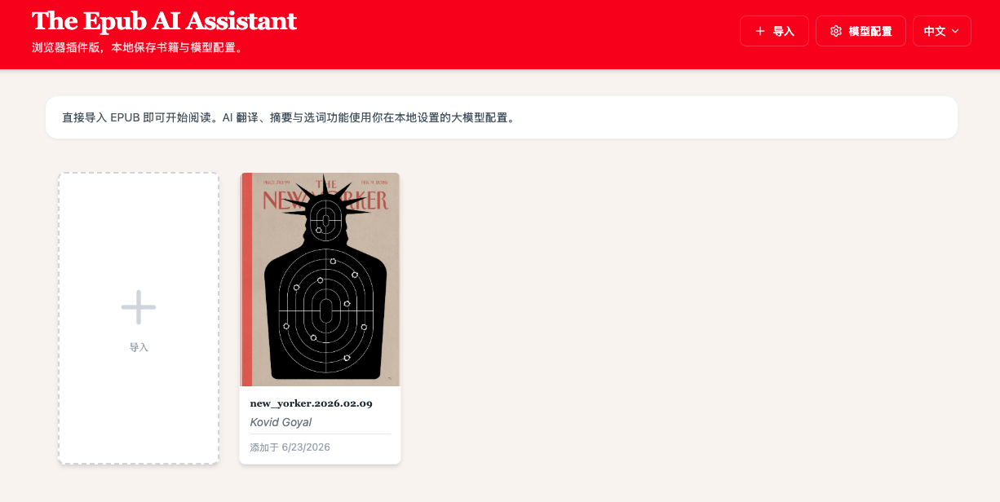
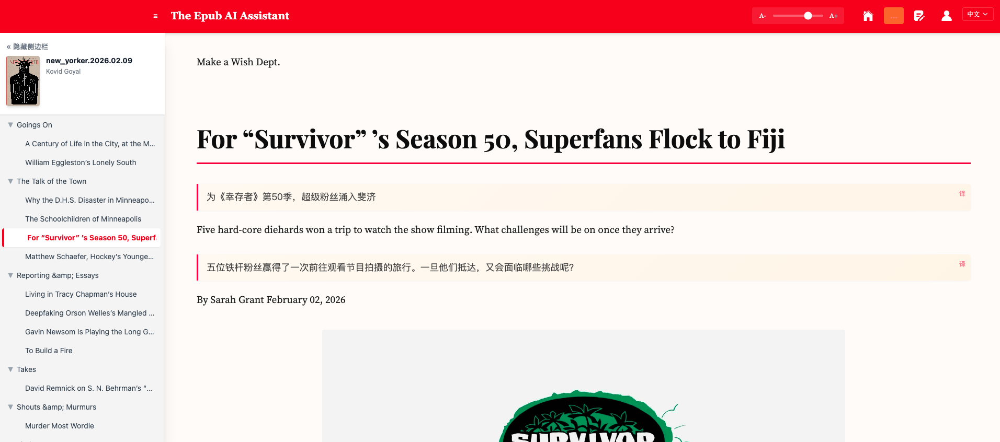

# The Epub AI Assistant

一个以 Chrome/Chromium 浏览器插件为目标形态的 AI EPUB 阅读器。

## 项目截图

### 书架首页



### 阅读器页面



## 当前方向

项目已经从原先的多形态方案收敛为：

1. 浏览器插件优先
2. 无用户登录
3. 本地书架
4. 本地保存大模型配置
5. 直连 OpenAI 兼容接口进行翻译、摘要和选词

## 核心能力

1. 导入本地 EPUB 文件
2. 通过 URL 拉取 EPUB
3. 本地 IndexedDB 保存图书
4. 章节阅读与目录跳转
5. 段落双语翻译
6. AI 摘要
7. 选词或短语翻译

## 本地开发

```bash
npm install
npm run dev
```

## 构建插件

```bash
npm run build:ext
```

构建产物默认输出到 `dist/`，并通过 [public/manifest.json](public/manifest.json) 作为浏览器插件清单。

## 关键文件

1. [需求文档.md](需求文档.md)
2. [public/manifest.json](public/manifest.json)
3. [src/App.tsx](src/App.tsx)
4. [src/components/settings/SettingsModal.tsx](src/components/settings/SettingsModal.tsx)
5. [src/core/llm/LLMClient.ts](src/core/llm/LLMClient.ts)
6. [src/core/db/BookDatabase.ts](src/core/db/BookDatabase.ts)

## 说明

当前仓库已经移除了登录、支付、邀请和后台主路径。若需要进一步精简，可继续删除剩余未使用的资源文件与测试样例。
